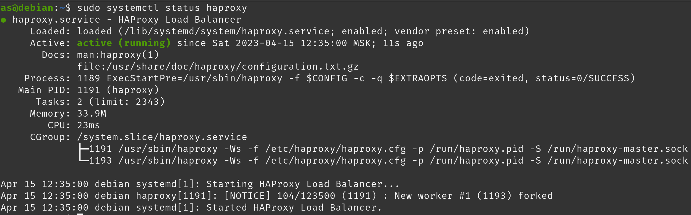
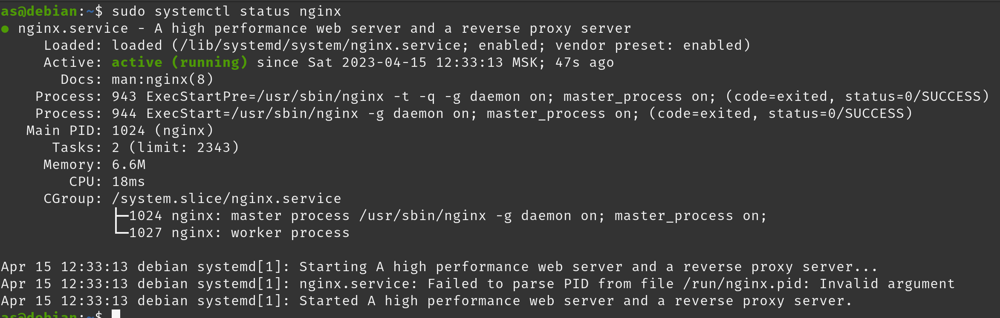
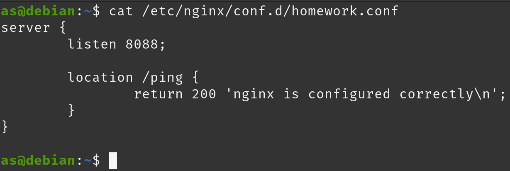

# Домашнее задание к занятию "10.5 Балансировка нагрузки. HAProxy/Nginx" - `Андрей Сотников`

---

### Задание 1

> Что такое балансировка нагрузки и зачем она нужна?

Балансировка - процесс распределения нагрузки на несколько выислительных ресурсов (серверов), происходящий на L4 или L7 уровнях модели OSI.

Применяется для оптимизации использования ресурсов, повышения отказоустойчивости, уменьшения времени отклика (например, для гео-балансировки) и регулирования используемых ресурсов (масштабируемости).

---

### Задание 2

> Чем отличаются алгоритмы балансировки Round Robin и Weighted Round Robin? В каких случаях каждый из них лучше применять?

**Round Robin** - алгоритм, который распределяет запросы последовательно по пулу ресурсов. Лучше всего работает, когда в пуле все сервера имеют одинаковую мощность.

**Weighted Round Robin** - распределение запросов происходит исходя из заданного "веса" сервера - чем большую мощность (вес) имеет сервер, тем больше запросов балансировщик будет перенаправлять на него. Лучше всего применять его в случаях, когда пул состоит из серверов различной мощности.

---

### Задание 3

> Установите и запустите Haproxy.
>
> _Приведите скриншот systemctl status haproxy, где будет видно, что Haproxy запущен._

---

### Задание 4

> Установите и запустите Nginx.
>
> _Приведите скриншот systemctl status nginx, где будет видно, что Nginx запущен._

---

### Задание 5

> Настройте Nginx на виртуальной машине таким образом, чтобы при запросе:
>
> `curl http://localhost:8088/ping`
>
> он возвращал в ответе строчку:
>
> "nginx is configured correctly".
>
> _Приведите конфигурации настроенного Nginx сервиса и скриншот результата выполнения команды `curl http://localhost:8088/ping`._

Сервис:  

curl:  

